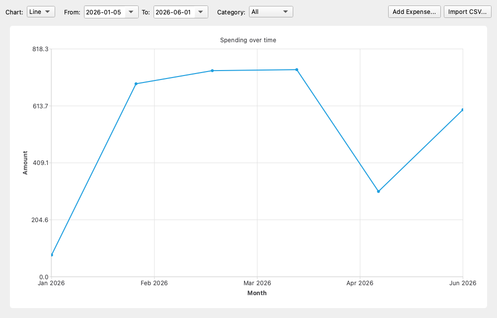
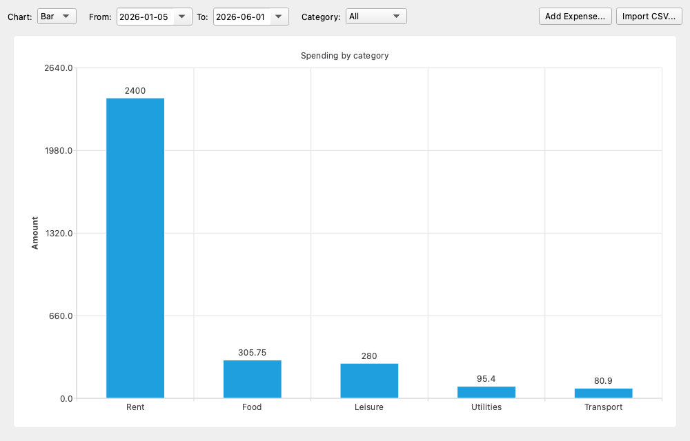
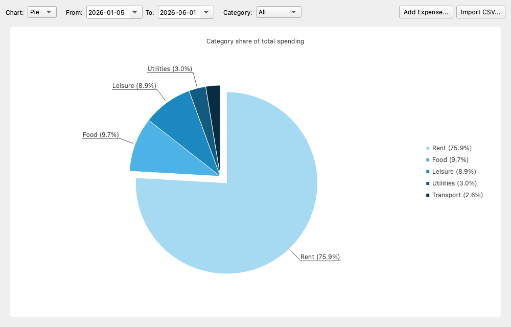
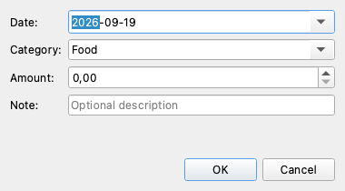

# 💰 Expense Tracker — Visualization Module

A small **C++ / Qt 6 desktop application** that turns a list of personal expenses
into clear, interactive **charts**. You can feed it data from a database, a CSV
file, or by typing expenses in by hand, then explore your spending as a **line**,
**bar**, or **pie** chart — filtered by date range and category.

It was written as a coursework project, so the code is deliberately **layered,
commented, and free of "magic numbers"** to make it easy to read and defend.

---

## Table of contents

1. [What the app does](#1-what-the-app-does)
2. [Screenshots (what you'll see)](#2-screenshots-what-youll-see)
3. [Technology stack](#3-technology-stack)
4. [How it works — architecture](#4-how-it-works--architecture)
5. [Where the data comes from](#5-where-the-data-comes-from)
6. [The data model](#6-the-data-model)
7. [How each chart works](#7-how-each-chart-works)
8. [Project structure](#8-project-structure)
9. [Building the app](#9-building-the-app)
10. [Running the app](#10-running-the-app)
11. [How to use it — step by step](#11-how-to-use-it--step-by-step)
12. [Edge cases handled](#12-edge-cases-handled)
13. [Design decisions (for the defense)](#13-design-decisions-for-the-defense)
14. [Troubleshooting](#14-troubleshooting)
15. [Possible extensions](#15-possible-extensions)

---

## 1. What the app does

The app answers three everyday questions about your spending:

| Question | Chart that answers it |
|----------|-----------------------|
| *"How is my spending changing over time?"* | **Line chart** (monthly trend) |
| *"Which categories cost me the most?"* | **Bar chart** (total per category) |
| *"What share of my money goes where?"* | **Pie chart** (percentage per category) |

**Key features**

- 📈 Three chart types — **line**, **bar**, **pie** — switchable at runtime (no restart).
- 🔎 Filter by a **date range** (from / to) and by **category** (or "All").
- 🏷️ See **exact values**: on hover (line), printed on the bar (bar), and in the slice label with a percentage (pie).
- ➕ **Add Expense** form for typing a cost in by hand.
- 📄 **CSV import** that validates rows, adds the good ones, and reports the bad ones.
- 💾 Data is stored in a real **SQLite database**, so it persists between runs.
- 🛡️ Never crashes on empty data, filtered-to-nothing data, an inverted date range, or malformed import rows.

---

## 2. Screenshots (what you'll see)

*(These are real renders of the running app — see the `docs/` folder.)*

**Line chart** — monthly spending trend; hover any point for its exact value:



**Bar chart** — total per category, with the amount printed above each bar:



**Pie chart** — each category's percentage share. Labels sit *outside* the pie
on connector arms so names never overlap; the biggest slice is "exploded" for
emphasis, and the legend on the right lists every category:



**Add Expense form** — manual entry; the category is an editable combo (pick one
or type a new one) and the amount cannot go negative:



---

## 3. Technology stack

| Concern | Choice |
|---------|--------|
| Language | **C++17** |
| GUI + charts | **Qt 6** — modules `Widgets`, `Charts`, `Sql` |
| Database | **SQLite** (through Qt's `QSQLITE` driver) |
| Import format | **CSV** (uses only Qt built-ins — no external libraries) |
| Build system | **CMake** (≥ 3.16) |

---

## 4. How it works — architecture

The app is split into **three layers**, each with one job. A layer only talks to
the one below it, which keeps the code easy to test and reason about.

```
┌──────────────────────── UI LAYER ────────────────────────┐
│  ChartView (QWidget)          AddExpenseDialog (QDialog)   │
│  • filter controls            • manual-entry form         │
│  • draws line/bar/pie                                      │
└───────────────▲───────────────────────────┬──────────────┘
                │ std::vector<Expense>        │ Expense / CSV path
                │ (data to draw)              │ (user actions, via signals)
┌───────────────┴──────────── LOGIC LAYER ───┴──────────────┐
│  ChartDataBuilder (stateless)                              │
│  • applyFilter()      → keep matching expenses             │
│  • totalsByPeriod()   → totals per month (line)           │
│  • totalsByCategory() → totals per category (bar/pie)     │
└───────────────▲───────────────────────────────────────────┘
                │ std::vector<Expense>
┌───────────────┴──────────── DATA LAYER ───────────────────┐
│  ExpenseRepository                                         │
│  • SQLite CRUD (getAll/add/update/remove)                 │
│  • importCsv()  • seedSampleData()                        │
└────────────────────────────────────────────────────────────┘
                │
          ┌─────┴─────┐
          │ expenses.db│  (SQLite file on disk)
          └───────────┘
```

**The golden rule:** the UI never writes SQL. When the user imports a CSV or adds
an expense, the UI just **emits a signal**; `main.cpp` (which owns the
repository) does the database work and then hands a fresh
`std::vector<Expense>` back to the chart. This is why the chart code has no idea
whether a number came from the database, a CSV file, or a typed-in form.

**Responsibilities at a glance**

| Layer | Class | Responsibility |
|-------|-------|----------------|
| Data | `ExpenseRepository` | Own the SQLite connection; CRUD; CSV import; seeding. Returns `std::vector<Expense>`. |
| Logic | `ChartDataBuilder` | Filter and aggregate expenses. Pure/stateless → unit-testable without a database or UI. |
| UI | `ChartView` | Draw the aggregated data with QtCharts; hold the filter controls and toolbar buttons. |
| UI | `AddExpenseDialog` | Collect and validate a single manually-entered expense. |
| — | `main.cpp` | Wire the three layers together. |

---

## 5. Where the data comes from

All three sources ultimately produce the **same** `std::vector<Expense>`, and all
of them flow through the repository:

```
   expenses.db (SQLite) ─┐
   sample.csv (import)   ─┼─► ExpenseRepository ─► std::vector<Expense> ─► ChartView
   Add Expense form      ─┘
```

1. **SQLite database (primary source).** A file called `expenses.db` is created
   automatically in the OS app-data folder. `getAll()` runs
   `SELECT … FROM expenses ORDER BY date` and returns the rows.

2. **Seed data (first run only).** The very first time you launch the app the
   table is empty, so `seedSampleData()` inserts 10 realistic sample rows
   (Food / Transport / Rent / Leisure across three months) so the charts aren't
   blank. This runs **only once** — after that the data persists.

3. **CSV import.** The **Import CSV…** button reads a file, validates each row,
   inserts the valid ones, and lists any it skipped.

4. **Manual input.** The **Add Expense…** button opens a small form; the entered
   expense is saved to the database and the chart refreshes immediately.

> 📍 On macOS the database lives at:
> `~/Library/Application Support/Financial_Assistant/expenses.db`
> Delete that file to reset the app to a clean, freshly-seeded state.

---

## 6. The data model

Every layer speaks in terms of this one struct (`Expense.h`):

```cpp
struct Expense {
    int     id       = 0;   // unique id from the database (0 = not stored yet)
    QDate   date;           // date of the expense
    QString category;       // e.g. "Food", "Transport"
    double  amount   = 0.0; // amount, always >= 0
    QString note;           // optional description
};
```

The matching SQLite table (created automatically):

```sql
CREATE TABLE IF NOT EXISTS expenses (
    id        INTEGER PRIMARY KEY AUTOINCREMENT,
    date      TEXT    NOT NULL,          -- stored as "YYYY-MM-DD"
    category  TEXT    NOT NULL,
    amount    REAL    NOT NULL CHECK (amount >= 0),
    note      TEXT
);
```

---

## 7. How each chart works

All charts start from the **filtered** expenses (date range + category are
applied *before* any aggregation, inside `ChartDataBuilder`).

- **Line — "Spending over time"**
  Uses `totalsByPeriod(…, Period::Monthly)` to sum expenses per calendar month.
  Drawn with `QLineSeries` on a `QDateTimeAxis`. **Hover** a point to see its
  exact date and value in a tooltip.

- **Bar — "Spending by category"**
  Uses `totalsByCategory(…)`. Each bar is one category (`QBarSeries` +
  `QBarCategoryAxis`); the amount is printed above each bar.

- **Pie — "Category share of total spending"**
  Uses `totalsByCategory(…)`. Each slice is a category labelled with its
  **percentage**. To keep it readable:
  - labels are placed **outside** the pie on connector arms (so they never pile
    up in the centre),
  - the pie is slightly shrunk to make room for those labels,
  - very thin slices (< 3%) hide their on-slice label but remain in the legend,
  - the **largest** slice is "exploded" outward for emphasis.

---

## 8. Project structure

```
Financial_Assistant/
├── CMakeLists.txt            # build configuration (Qt6 Widgets/Charts/Sql)
├── main.cpp                  # demo: wires data → logic → UI together
├── Expense.h                 # the shared data model (DTO)
├── ExpenseRepository.h/.cpp  # DATA layer: SQLite CRUD + CSV import + seeding
├── ChartDataBuilder.h/.cpp   # LOGIC layer: filtering + aggregation (stateless)
├── ChartView.h/.cpp          # UI layer: the charts + filter controls
├── AddExpenseDialog.h/.cpp   # UI layer: the manual "Add expense" form
├── sample.csv                # demo import file (includes 3 deliberately bad rows)
├── docs/                     # screenshots used in this README
└── README.md                 # this document
```

---

## 9. Building the app

**Prerequisites**

- Qt 6 with the **Widgets**, **Charts**, and **Sql** modules
- CMake ≥ 3.16 and a C++17 compiler

**macOS (Homebrew Qt)**

```bash
# from the project root
cmake -S . -B build -DCMAKE_PREFIX_PATH="$(brew --prefix qt)"
cmake --build build
```

**Other systems**

Point `CMAKE_PREFIX_PATH` at your Qt 6 install — the folder that contains
`lib/cmake/Qt6`:

```bash
cmake -S . -B build -DCMAKE_PREFIX_PATH="/path/to/Qt/6.x.x/gcc_64"
cmake --build build
```

**In CLion**

Open the folder; CLion picks up `CMakeLists.txt` automatically. Make sure Qt is
on the CMake prefix path (Settings → Build → CMake → *CMake options*:
`-DCMAKE_PREFIX_PATH=/opt/homebrew/opt/qt` on macOS), then just press **Run**.

---

## 10. Running the app

```bash
./build/Financial_Assistant
```

On first launch the database is created and seeded, and the window opens showing
a chart of the sample data.

---

## 11. How to use it — step by step

1. **Pick a chart type.** Use the **Chart** dropdown to switch between *Line*,
   *Bar*, and *Pie*. The view updates instantly — no restart.

2. **Filter by date.** Set the **From** and **To** dates. Only expenses in that
   range are aggregated and drawn. (If *From* is later than *To*, the app shows a
   friendly warning instead of a broken chart.)

3. **Filter by category.** Use the **Category** dropdown to focus on one category,
   or choose **All** to see everything.

4. **Read exact values.** Hover a point on the *line* chart for a tooltip; read
   the number above each *bar*; read the percentage in each *pie* slice/legend.

5. **Add an expense by hand.** Click **Add Expense…**, fill in the date,
   category (pick an existing one or type a new one), amount, and an optional
   note, then **OK**. It's saved and the chart refreshes.

6. **Import a CSV.** Click **Import CSV…** and choose a file (try the bundled
   `sample.csv`). Valid rows are added; a summary tells you how many were
   imported and lists any that were skipped and why.

**CSV format** — a header row is required, columns are `date,category,amount,note`:

```csv
date,category,amount,note
2026-04-02,Food,53.10,Groceries
2026-05-27,Leisure,120.00,"Weekend trip, hotel"
```

- `date` must be `YYYY-MM-DD`
- `amount` must be numeric and `>= 0`
- commas inside a field are supported if the field is wrapped in `"quotes"`

---

## 12. Edge cases handled

| Situation | What the app does |
|-----------|-------------------|
| No expenses at all | Shows a centred **"No data to display."** message (no crash). |
| Filters match nothing | Shows **"No expenses match the current filters."** |
| `From` date after `To` date | Shows an **inverted-range warning** instead of drawing. |
| CSV row with a bad date / negative / non-numeric amount | **Skips** that row and reports it; the rest still import. |
| Very long category name | **Truncated** with an ellipsis in chart labels. |
| Manual amount left at 0 or category empty | Form **blocks OK** and explains what's wrong. |

---

## 13. Design decisions (for the defense)

- **Strict layering.** Data / logic / UI are separate classes. The UI never
  issues SQL; it goes through `ExpenseRepository`. This is the single most
  important design choice and makes each part independently testable.

- **The logic layer is stateless.** `ChartDataBuilder` has only static methods
  that take a vector and return aggregated data — so it can be unit-tested with
  plain data, no database or window required.

- **Signals instead of a repository pointer in the UI.** `ChartView` emits
  `importCsvRequested()` / `addExpenseRequested()`; `main.cpp` performs the
  database work. The UI therefore doesn't even hold a database reference, which
  keeps the dependency arrows pointing one way (UI → logic → data).

- **A spin box for the amount** makes negative or non-numeric manual input
  *impossible by construction*, rather than validating it after the fact.

- **No magic numbers.** Tunables (label-truncation length, pie size, the small-
  slice label threshold, axis headroom, explode distance, …) are named
  constants at the top of each file.

- **Qt parent–child ownership everywhere**, so there are no manual `delete`s and
  no memory leaks: deleting a widget deletes its children.

---

## 14. Troubleshooting

- **CLion shows red squiggles like `'QDate' file not found` / `Q_OBJECT unknown`.**
  These are indexing errors, not compile errors. Reload the CMake project
  (Tools → CMake → *Reset Cache and Reload Project*) and make sure Qt is on the
  CMake prefix path. A command-line `cmake --build` will succeed regardless.

- **CMake can't find Qt6.**
  Pass `-DCMAKE_PREFIX_PATH=<your Qt path>` (the folder containing
  `lib/cmake/Qt6`). On macOS/Homebrew that's `$(brew --prefix qt)`.

- **The app runs but no window appears / "could not connect to display".**
  You need a graphical session; this is a desktop GUI app.

- **I want to start over with empty/seed data.**
  Delete `expenses.db` from the app-data folder (see [section 5](#5-where-the-data-comes-from))
  and relaunch.

---

## 15. Possible extensions

- Edit / delete existing expenses (the repository already has `update()` and
  `remove()` — only UI is missing).
- Daily granularity toggle for the line chart (`Period::Daily` already exists).
- Excel (`.xlsx`) import via the QXlsx library, alongside CSV.
- Unit tests for `ChartDataBuilder` (it's designed to make this trivial).
- Export the current chart as an image.
